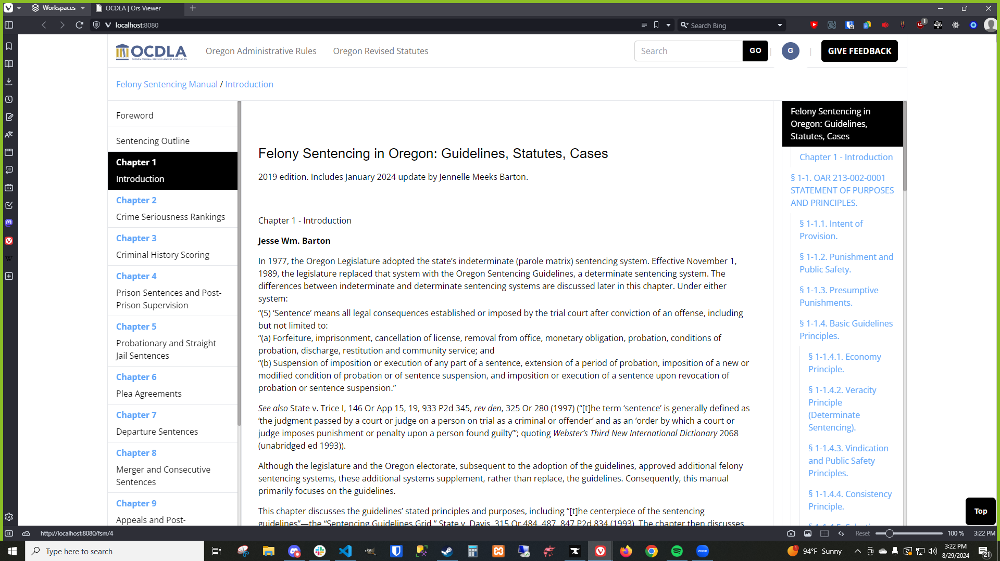

# Outline Component
## Overview
The Outline Component generates a list of the important sections of the HTML on your webpage. This sidebar is built based on the query selectors you pass in, allowing for flexible and customizable navigation structures. Perfect for enhancing the user experience on content-heavy websites or documentation pages.



## Features

- **Dynamic Sidebar Navigation:** Automatically creates a navigation sidebar based on HTML content.
- **Customizable Query Selectors:** Define which elements are included in the sidebar using query selectors.
- **Easy Integration:** Simple setup and integration into existing HTML pages.

## Installation

You can install this via NPM:
```bash
npm install @ocdla/outline
```
Then, import it into your JavaScript:
```javascript
import Outline from '@ocdla/Outline';
```

## Usage

### Basic use case
Basic usage is as follows:
- Create a new outline object specifying the region to parse
- Parse the region with the outline method `outline.outline()` passing in query selectors in order of importance. Level 1 top level items should be listed first.
- Retrieve the outline via one of the methods shown below.
```javascript
import Outline from '@ocdla/Outline';


// You can create an outline from the full document, or by specifying a parent element to get a more specific section.
const outline = Outline.fromCurrentDocument();
const bodyOutline = new Outline(document.querySelector('#body'));

// You can pass in any valid CSS query selectors. The order here matters, as the first arguments passed in are considered closer to root level.
outline.outline(
  "h1",
  "h2",
  "h3",
  "h4"
);

// Returns a parent <ul> object that contains a <li> entry for each outline item with nested <ul> elements for any indentation
outline.toNodeTree();

// Counter intuitive example
outline.outline(
  "h4",
  ".subsection",
  "h3",
  "h1"
);

// Returns an array of nested outline item objects, each nested in the 'children' instance array of their parent
// This would be used if you're using some form of JSX or you had more manipulation to perform.
const nestedOutline = outline.getNested();

// Returns an unstructured one dimensional array of outline item objects
const flatOutline = outline.getFlattened();

// Returns a string of HTML as if you used outline.toNodeTree();
const stringOutline = outline.toHtml();

```

```html
<ul>
  <li>Citrus</li>
  <li>
  <ul>
    <li>Orange</li>
    <li>Lemon</li>
  </ul>
  </li>
  <li>Vegetables</li>
</ul>
```

### Dynamic highlighting

Dynamic highlighting is accomplished via the [Intersection Observer API](https://developer.mozilla.org/en-US/docs/Web/API/IntersectionObserver) through the `Outline.addIntersectionObserver()` method.
In the example below, an IntersectionObserver is used to create an interactive outline that highlights outline items as their respective sections are scrolled to.

```javascript
 // Callback function used to detect where the user is on the page.
      const handleIntersection = (observedEntries) => {
        // Filter out entries that are not intersecting
        const intersectingEntries = observedEntries.filter(
          (entry) => entry.isIntersecting
        );

        // Make sure we have at least one entry remaining
        if (intersectingEntries.length == 0) return;

        // We only want the first entry. It's possible to scroll through multiple headings at once.
        const entry = intersectingEntries[0];
        const id = entry.target.id;
        const outlineListItem = document.getElementById(`${id}-outline-item`);

        // When we see a new item, we want to make sure the outline sidebar is scrolling to it.
        outlineListItem.scrollIntoView({
          behavior: "instant",
          block: "nearest",
          inline: "center",
        });
      };

      // Add the callback function to the intersection observer.
      outline.addIntersectionObserver(handleIntersection);


      // You can also specify a set of options to pass in per the Intersection Observer documentation
      const options = {
        root: this.#doc,
        rootMargin: "0px",
        threshold: 0.1,
      };

      outline.addIntersectionObserver(handleIntersection, options);
```
